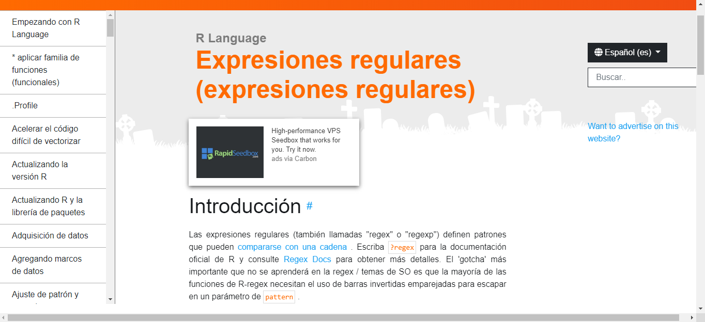

# 1.Comparativa de expresiones regulares <a name="id1"></a> #  
  ----------------------------------------

## 1.1.Primera página <a name="id2"></a> #   

<div style="text-align: justify">

La primera página utilizada para realizar esta comparativa es : 
<a href="https://riptutorial.com/es/r/topic/5748/expresiones-regulares--expresiones-regulares-" target="_blank">**RipTutorial**</a>  

<center>  </center>


Esta página ofrece un apredizaje básico sobre expresiones regulares en R, en especial me gusta la simpleza y los colores caracteristicos de la página.  

Por otro lado, a la hora de entender en contenido de la misma, se me hace complicado comprenderlo, ya que la explicación sobre cada campo es muy simple. 
<div/>

|      **Pros**       |  **Contras**                  |
|:-------------:      |--------------------:          |
|  Informacion basica | Poca información en ocasiones |
|    Colores          | Poca claridad                 |
| Interactividad      | Falta de una opcion en ingles |  


## 1.2.Segunda página <a name="id3"></a> # 


La segunda página utilizada es: 
<a href="http://rpubs.com/ydmarinb/429756" target="_blank">**RPubs**</a>  

<center>  </center>

<div style="text-align: justify">

En un primer lugar, RPubs nos ofrece una pequeña introduccion de lo que son las expresiones 
regulares en R. 

RPubs ofrece un indice flotante en la parte izquierda de la página, que facilita enormemente la busqueda rapida de información.

Ofrece mucha mas información, bastante mejor organizada que la pagina anterior, facilita enormemente la tarea de comprension del codigo y cual es el uso de cada comando.  

Lo que mas me gusta de esta página, es que incluye ejemplos en su parte final, te muestra como utilizar el código y cual va a ser su resultado final.
<div/>

|      **Pros**                   |  **Contras**                  |
|:-------------:                  |--------------------:          |
| Gran variedad de explicaciones  |                               |
| Simpleza                        |                               |
| Indice flotante                 |                               |  
 


# 2.Comparativa de expresiones Markdown <a name="id4"></a> #  
  
  ----------------------------------------
  
## 2.1.Primera página  <a name="id5"></a> # 


La primera página de expresiones de Markdown que ha sido utilizada es:
<a href="https://rstudio.com/wp-content/uploads/2015/02/rmarkdown-cheatsheet.pdf" target="_blank">**Markdown Cheat Sheet**</a>.  

<center>  </center>  
  
<div style="text-align: justify">    

Esta primera web, ofrece una gran cantidad de información muy útil a la hora de empezar a jugar con markdown.  

Enseña como realziar practicamente cualquier tipo de accion con este lenguaje, enseñando como es su sintaxis y cual va a ser el resultado final.  

La página esta dividida en nueve puntos diferentes, cada uno trata un punto diferente de markdown. Desde una pequeña definición, hasta como darle forma al formato final.  

Por otro lado, como punto negativo a la pagina, me parece que la información se encuentra demasiado comprimida.

El orden de la pagina tampoco me parece el mas adecuado, resulta muy sencillo perderse en ella. 
<div/>

|      **Pros**                   |  **Contras**                  |
|:-------------:                  |--------------------:          |
|  Gran compresion                |     Colores no atractivos     |
|  Mucha información              |     Mal ordenado              |
|   Simpleza                      |      Falta de ejemplos        |   

## 2.2.Segunda página  <a name="id6"></a> #  


La segunda página que he utilizado es:
<a href="https://markdown.es/sintaxis-markdown/">**Markdown.es**</a>.  

<center>  </center>  

<div style="text-align: justify">

Esta página ofrece una vision mucho mas amplia de toda la sintaxis que nos ofrece Markdown, ofreciendonos en primer lugar un video de como aprender Markdown rapidamente.  

El índice de la sintaxis que ofrece esta página me parece excelente, ya que puedes seleccionar el punto que nos interesa rapidamente.  

La información aparece mucho mejor redactada que la página anterior, incluyendo una breve explicación de todos los puntos, lo que facilita la comprensión.  

Por último, como punto muy positivo a esta pagina, es su parte final, donde puedes incluir comentarios y preguntas,se da soporte a cualquier tipo de duda que pueda surgir sobre el tema.  
<div/>

|      **Pros**                   |  **Contras**                  |
|:-------------:                  |--------------------:          |
|  Explicacion detallada          |     Excesivas explicaciones   |
|  Indice interactivo             |     Página poco llamativa     |
|   Comentarios                   |                               |  

# 3.Estudio y muestreo de datos <a name="id7"></a> #  
  ----------------------------------------
En primer lugar vamos a utilizar la libreria ggplot2 y reshape para mostrar una serie de datos y realizar un breve anilisis de los mismos.

```{r echo=FALSE, warning=FALSE, message=FALSE}

casa <- read.csv("Recursos/datos_estados.csv", sep= ",")
```

```{r echo=FALSE, warning=FALSE, message=FALSE}
library(knitr)
library(kableExtra)

kable(head(casa))
``` 
Aqui tenemos nuestro dataset cargado, el cual tiene el nombre de "`casa`", en el cual se trata de un dataset abierto, en el que aparecen las siguientes columnas:  

```{r echo=FALSE, warning=FALSE, message=FALSE}
kable(colnames(casa))
```

Podemos analizar cual es el precio mas comun de las casas, independientemente del estado y de la fecha.

```{r echo=FALSE, warning=FALSE, message=FALSE}
library(ggplot2)
library(tidyverse)
library(ggthemes)

ggplot(casa, aes(x= Home.Value,)) + 
      geom_histogram() + theme_excel() + scale_fill_excel('fill')
```

Continuando con el análisis, podemos comparar el crecimiento del precio en diferentes estados, en este caso son Nuevo Mexico, Texas y Nueva York a lo largo de los años.

```{r echo=FALSE, warning=FALSE, message=FALSE}
ggplot(filter(casa, State %in% c("NM", "TX", "NY")),
       aes(x=Date,
           y=Home.Value,
           color=State))+
  geom_point()

```

Se puede observar claramente, que el precio de la vivienda en Nueva York es bastante superior que el resto.  
A continuación voy a mostrar el cambio de precios en la vivienda en todos los estados a lo largo de los años.

```{r echo=FALSE, message=FALSE, warning=FALSE,}

tabla <- ggplot(casa, aes(x = Date, y = Home.Value))

tabla + geom_line(aes(color = State))
```  
  
  
Nos escontramos ante una gran cantidad de datos, ya que existen muchos estados, podemos extraer, tres ejemplos y compararlos entre si, para poder apreciarlos con mayor facilidad.  


```{r echo=FALSE, message=FALSE, warning=FALSE,}
(faceta_fin <- tabla + geom_line() +
   facet_wrap(~c("NY","ID","IL"), ncol = 3, ))
```


